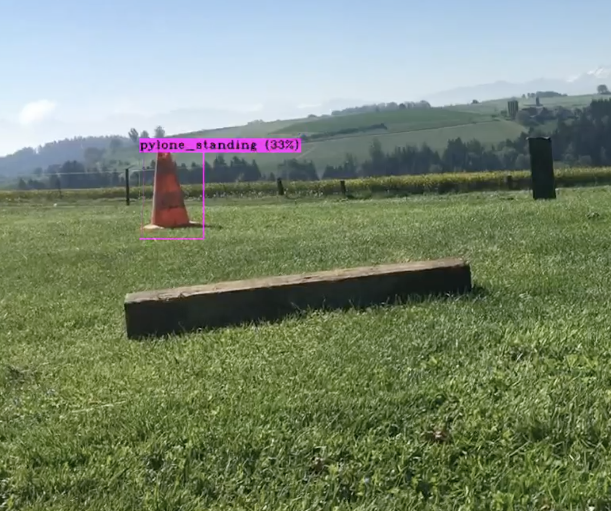

# MODUL-PREN

A Project where we had to build an autonomous vehicle. Due to COVID-19 we just could simulate this software.
We used a Nvidia Jetson Nano and build our ObjectDetector with YOLOv2: https://pjreddie.com/darknet/yolov2/

Link to the images: https://www.dropbox.com/sh/jcdc9pqbapmw209/AAAcK_Fr7BdKl-AXpAZ6k2C8a?dl=0
